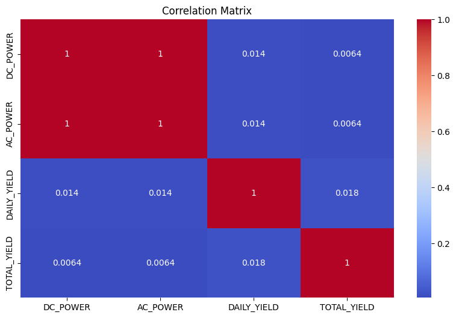
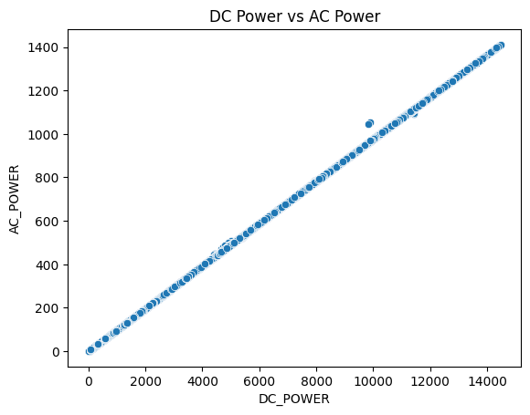
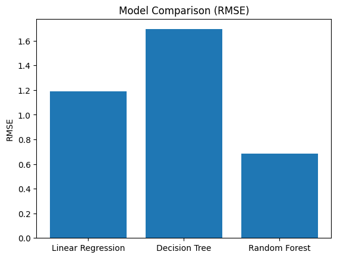
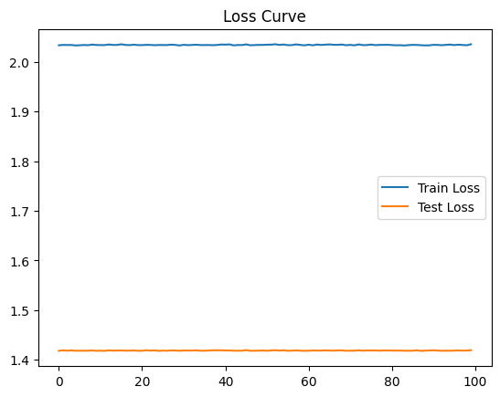
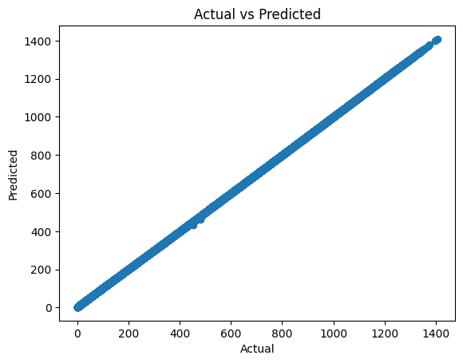
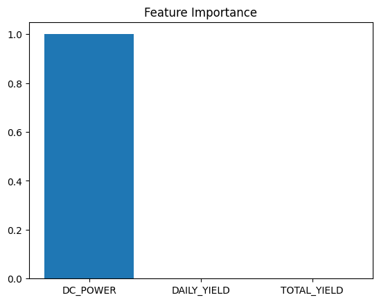

# Solar Power Output Prediction

## Mission & Problem
This project predicts solar plant `AC_POWER` from real inverter generation signals instead of using a generic or house-price dataset.
The goal is to support solar operations by estimating output from `DC_POWER`, `DAILY_YIELD`, and `TOTAL_YIELD`.
That makes the use case specific to renewable-energy monitoring and deployment.

## Dataset & Source
- Public dataset source: Kaggle Solar Power Generation Data, https://www.kaggle.com/datasets/anikannal/solar-power-generation-data
- Repository copy used in this project: `summative/linear_regression/Plant_1_Generation_Data.csv`
- Dataset size: `68,778` rows and `7` columns
- Daytime rows used after filtering `DC_POWER > 0`: `36,827`
- Target column: `AC_POWER`
- Final modeling features: `DC_POWER`, `DAILY_YIELD`, `TOTAL_YIELD`

## Repository Structure
```text
linear_regression_model/
├── README.md
└── summative/
    ├── linear_regression/
    │   ├── multivariate.ipynb
    │   ├── Plant_1_Generation_Data.csv
    │   ├── best_model.pkl
    │   ├── scaler.pkl
    │   ├── features.pkl
    │   └── plots/
    ├── API/
    │   ├── main.py
    │   ├── prediction.py
    │   ├── model_service.py
    │   ├── requirements.txt
    │   └── artifacts/
    └── FlutterApp/
        └── solar_app/
```

## Task 1: Regression Notebook
Notebook: `summative/linear_regression/multivariate.ipynb`

The notebook:
- loads the Plant 1 generation dataset
- removes night-time rows with `DC_POWER <= 0`
- drops identifier and timestamp columns from the final training matrix: `DATE_TIME`, `PLANT_ID`, `SOURCE_KEY`
- standardizes the final features with `StandardScaler`
- compares `Linear Regression`, `Decision Tree`, and `Random Forest`
- tracks gradient-descent training with `SGDRegressor` and a train/test loss curve
- saves the best model plus preprocessing artifacts for deployment
- demonstrates single-record prediction with the saved model

### Model Results
Results below are from `summative/API/artifacts/metrics.json` and match the deployed model metadata.

| Model | RMSE |
| --- | ---: |
| Linear Regression | 1.1910 |
| Decision Tree | 1.6936 |
| Random Forest | 0.6830 |

Best saved model:
- Notebook artifact: `summative/linear_regression/best_model.pkl`
- API deployment artifact: `summative/API/artifacts/best_model.joblib`

### Visualizations
These plots were extracted from the notebook outputs and stored under `summative/linear_regression/plots/`.

#### Correlation Heatmap


#### DC Power vs AC Power


#### Model Comparison by RMSE


#### Gradient Descent Loss Curve


#### Actual vs Predicted Scatter


#### Feature Importance


## Task 2: FastAPI Prediction Service
API source folder: `summative/API/`

### Live Deployment
- Public Swagger UI: `https://linearregressionmodel-production-31a6.up.railway.app/docs`
- Prediction endpoint: `https://linearregressionmodel-production-31a6.up.railway.app/predict`
- Health endpoint: `https://linearregressionmodel-production-31a6.up.railway.app/health`
- Live docs and prediction endpoint were verified on `2026-03-27`

### Implemented Endpoints
- `GET /health` returns model metadata, selected features, dataset path, training timestamp, and RMSE values
- `POST /predict` returns predicted `AC_POWER`
- `POST /retrain` retrains the model from the existing CSV or an uploaded CSV file
- `POST /retrain/stream` retrains the model from streamed JSON records

### Validation and CORS
- Pydantic enforces numeric data types for every input field
- Range constraints are enforced:
  - `DC_POWER`: `> 0` and `<= 15000`
  - `DAILY_YIELD`: `>= 0` and `<= 10000`
  - `TOTAL_YIELD`: `>= 6000000` and `<= 8000000`
- Cross-field validation requires `TOTAL_YIELD > DAILY_YIELD`
- CORS middleware is enabled with explicit origins, methods, headers, and credentials
- The API does not use wildcard `*` origins

### Local API Run
```bash
cd summative/API
python3 -m venv .venv
source .venv/bin/activate
pip install -r requirements.txt
uvicorn main:app --reload
```

Local Swagger UI:
- `http://127.0.0.1:8000/docs`

Sample prediction request:
```bash
curl -X POST "http://127.0.0.1:8000/predict" \
  -H "Content-Type: application/json" \
  -d '{"DC_POWER":1000,"DAILY_YIELD":5000,"TOTAL_YIELD":7000000}'
```

Sample live response:
```json
{
  "predicted_AC_POWER": 97.0561,
  "best_model_name": "Random Forest",
  "feature_order": ["DC_POWER", "DAILY_YIELD", "TOTAL_YIELD"]
}
```

## Task 3: Flutter Mobile App
Flutter app folder: `summative/FlutterApp/solar_app/`

The app currently includes:
- one prediction page
- three text fields that match the three API input variables
- a `Predict` button
- an output panel for the predicted value or validation/error messages

The default app endpoint is already set to the live deployed API:
- `https://linearregressionmodel-production-31a6.up.railway.app/predict`

### Run the Flutter App
```bash
cd summative/FlutterApp/solar_app
flutter pub get
flutter run
```

To point the app to another deployment:
```bash
flutter run --dart-define=PREDICT_API_URL=https://your-api-domain.com/predict
```

The app also accepts a Swagger URL and normalizes it to `/predict`.

## Task 4: Video Demo
YouTube demo link:
- `TBD - replace this line with your final public YouTube demo URL before submission`

The video should show:
- the Flutter app making predictions
- Swagger UI testing of the API
- datatype and range validation
- notebook walkthrough for model creation and performance discussion

## Submission Readiness Check
### Already Covered in This Repo
- non-generic use case focused on solar plant power prediction
- non-house dataset
- dataset description and source in the README
- more than two meaningful visualizations
- linear regression, decision tree, and random forest code in the notebook
- standardization with `StandardScaler`
- gradient-descent loss curve with train and test loss
- saved best-performing model
- code for single-record prediction
- FastAPI prediction endpoint
- public Swagger UI URL
- Pydantic datatypes and numeric constraints
- explicit CORS configuration without wildcard origins
- retraining support through `/retrain` and `/retrain/stream`
- one-page Flutter app with inputs, button, and output area

### Still Worth Finishing Before Final Submission
- replace the `TBD` YouTube line with the final public demo link
- if your lecturer strictly requires Render instead of any public host, mirror or move the live API from Railway to Render
- the notebook uses an absolute CSV path, so convert it to a relative path before submission if the notebook must run on another machine
- the notebook's final scatter plot is `Actual vs Predicted`; if your instructor wants a literal regression line drawn over the raw data, add that plot in the notebook
- the single-row prediction example uses a random sample from `X`; if you want to match the rubric wording exactly, switch it to one row from `X_test`
- the assignment text mentions both `7 minutes` and `5 minutes`; follow the stricter `5-minute` limit unless your instructor confirms otherwise
